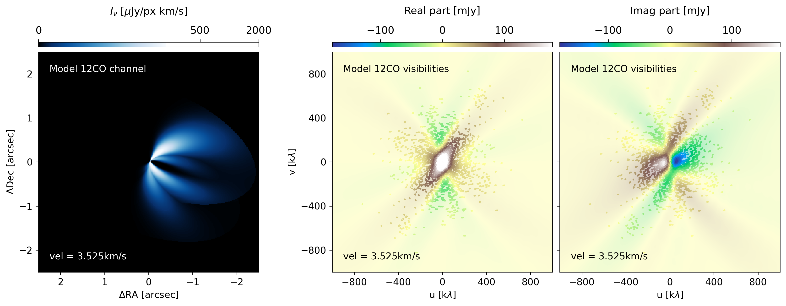

# Vishandling

Collection of codes to extract, handle, and insert visibilities from gas measurement sets to txt files, in CASA. All of these instructions are thought for extracting the visibilities of a single molecular line. You can adapt the codes for any emission line! 

Sections:
- [Extract gas visibilities from a measurement set](https://github.com/nicokurtovic/vis_handling?tab=readme-ov-file#extract-the-visibilities-of-your-gas-emission).
- [Insert gas visibilities into a measurement set](https://github.com/nicokurtovic/vis_handling?tab=readme-ov-file#insert-the-visibilities-of-your-model-in-a-measurement-set).
- [What to do if I have multiple spectral windows](https://github.com/nicokurtovic/vis_handling/blob/main/README.md#what-to-do-if-i-have-multiple-spectral-windows).
- [Notes about velocity reference system](https://github.com/nicokurtovic/vis_handling?tab=readme-ov-file#my-velocity-array-does-not-coincide-with-the-lsrk-velocities-from-tclean). 




## Extract the visibilities of your gas emission

The gas emission in a measurement set (from now on, ms files) is contained in channels, which are grouped in spectral windows. In this example, we will assume that only *one spectral window* is present in the ms file. You can check this by doing *listobs* in [CASA](https://casaguides.nrao.edu/index.php/ALMA_Tutorials). For multiple spectral windows, please check the Section "[what to do if I have multiple spectral windows](https://github.com/nicokurtovic/vis_handling/blob/main/README.md#what-to-do-if-i-have-multiple-spectral-windows)".

The necessary functions to extract the visibilities of each channel are in the file *CO_to_ascii.py*, which you should not need to modify. For the extraction of the visibilities, we will executre the code *CO_uvtable_extraction.py*, which is further explained in this Section. 

The first step in extracting the visibilities is to call the *CO_to_ascii.py* functions, as well as importing the [analysis utilities](https://casaguides.nrao.edu/index.php/Analysis_Utilities) of CASA ([CASA Team et al., 2022](https://ui.adsabs.harvard.edu/abs/2022PASP..134k4501C/abstract); [Hunter et al., 2023](https://ui.adsabs.harvard.edu/abs/2023PASP..135g4501H/abstract)). 

```
# Import the analysis scripts, available in:
# Remember to cite Hunter et al., (2023), for the analysis utils. 
# https://casaguides.nrao.edu/index.php/Analysis_Utilities
sys.path.append('/path_to_analysis_scripts/analysis_scripts/')
import analysisUtils as au

# Execute the supporting functions. 
execfile('./CO_to_ascii.py')
```

Several functions will be loaded from *CO_to_ascii.py*, the most relevant being *ms_to_ascii*, which takes a measurement set and writes the visibilities into txt format. Before we get to this point, we need to set the name, paths, and frequency of the line we are interested in working with. In this example, we will be extracting the visibilities of the 12CO J:2-1 emission of PDS111, published in Derkink et al., (incl. Kurtovic, 2024).

```
# Prefix for naming files
prefix = 'PDS111'

# Paths to measurement sets
work_dir = os.getcwd() + '/'
msfiles_dir  = work_dir + 'msfiles/'
uvtables_dir = work_dir + 'uvtables/'

# Measurement set
gas_msfile = msfiles_dir + 'PDS111_SB_12CO_selfcal.ms.contsub.cvel'

# Line information
line = '12CO'
freq_line = 230.5380000e9 # 12CO J=2-1, Hz
freq_GHz  = str(freq_line*1e-9)+'GHz'
```

It is convinient to create folders called *msfiles* and *uvtables* in the working directory. When extracting the visibilities, you need to decide if you want to extract all of them (including the flagged data), or only the unflagged visiblities. In this example, we will only extract the unflagged measurements:

```
# Extract flagged visibilities? False for no, True for yes
keepflags = False
```

**And that's all!** You should not need to modify anything else in the code. If you run it as is, the visibility table of each channel will be stored in the folder *uvtables_dir*, including two *.npy* files containing the velocity and frequency of each channel. 

> [!NOTE]
> Please check the frequency and velocity saved by the code, and compare them with those from *tclean* when you run using *outframe='LSRK'*. If they do not coincide, check Section "[My velocity array does not coincide with the LSRK velocities from tclean](https://github.com/nicokurtovic/vis_handling?tab=readme-ov-file#my-velocity-array-does-not-coincide-with-the-lsrk-velocities-from-tclean)".


In case you are interested in the details of the extraction, here's how it works: Before extracting the visibilities, we need to make sure the column of weights has been initialized in the measurement set. We can do this very simply by just running *initweigths*.

```
# Initialize weight column
initweights(vis=gas_msfile, wtmode='weight', dowtsp=True)
```

Now, we will iterate over every channel of the spectral window. For each channel, we will:
1) Run *split* to obtain a ms file set containing only 1 channel.
2) Save the frequency information of the channel.
3) Use *ms_to_ascii* to write the visibilities of that single channel.
4) Delete all intermediate files, and move to the next channel. 

After finishing running through all of the channels in the *for* cycle, two numpy arrays will be written in *npy* format: *freqs* containing the frequency of every channel (in the same order as the numbering the txt files), and *vels* containing the central velocity of every channel. You can read both of this in Python using *np.load*. 


## Insert the visibilities of your model in a measurement set

In order to write your model visibilities into a ms file, you need to save the model visibilities in *.txt* format with the same data structure as the extracted visibilities from the previous section. These files have 5 columns: (u, v, Real, Imag, weight), separated by spaces. 

To write the model visibilities we will use the code *CO_uvtable_insertion.py*. The first part of the code will look very familiar to you, with the import of the *CO_to_ascii.py* functions, as well as the analysis utils. The paths, names, and *keepflags* should be the same as when you ran the extraction code. There are only two new parameters for the insertion: 
1) prefix_mod: The name of the tables containing the visibilities
2) new_mod_ms: The name of the ms file where the model visibilities will be written.

The *new_mod_ms* will contain the same information as the original ms file, but the visibilities of the data will be replaced with those of the model. Make sure the naming convention for *prefix_mod* coincides with that of your model visibilities, following the instructions in the code. If all of this is correct, then the code should run from beginning to end without problems, **that's all!**

Are you interested in how the visibilities are written into a measurement set? The process is very similar to the extraction:
1) A temporary ms file is split, containing a single channel.
2) The visibilities of the model are written into this temporary ms file
3) The temporary ms file is concatenated with the previous channel, and iterates until all of the channels are concatenated.

The resulting ms file will have as many spws as the number of channels in the original ms file. This architecture is a direct result of building the ms file by concatenating. You can return everything to a single spw it using *cvel2*, but otherwise, having the channels in separate spectral windows does not affect how tclean works. 


## What to do if I have multiple spectral windows

When combining multiple observations (either multiple antenna configurations, or several different visits to the same target), you might end up with multiple spectral windows containing the line emission you want to extract. There are two different approaches you can take to extracting the visibilities in this scenario:

**Scenario 1**, Re-bin the data to the lowest frequency resolution: Multiple spectral windows can be binned into a single spectral window using the function *cvel2* in CASA, thus obtaining a measurement set with a single spectral window, but limiting the frequency resolution to the lowest frequency resolution of your datasets. This solution is exampled in the code *reduce_spw.py*, where the original measurement set of PDS111 was reduced from two spectral windows into one. 

**Scenario 2**, Conserve the information of each spectral window: In the case of multiple observations of the same target, you can potentially have channels of different frequency width, which you want to conserve and model independently to conserve flux and velocity information. In this case, I recommend using *split* to separate the original measurement set into several measurement sets containing one spectral window each. Then, you can execute the codes of this repository in each ms file, and make sure to save the channel visibilities in different *uvtable_dir*.


## My velocity array does not coincide with the LSRK velocities from tclean. 

Using *tclean*, you generated the cube of the line you want to extract, and you noticed that the velocities in the cube are not the same as those from the extracted visibilities in the *vels* array. If this happens to you, it is very likely that the extracted velocities (frequencies) of each channel are in the *TOPO* reference frame, instead of the *LSRK*. You can check if this is the case by running *tclean* with *outframe='TOPO'*, and confirm if the velocities coincide with those of *vels*. 

For most applications, this should potentially only introduce a constant offset to the velocities. You can solve it at the measurement set level by using *cvel2*, and setting the reference frame of the ms file to *LSRK*, or you can consider an offset when you read the velocities in Python. Alternatively, you can also run the function from analysis utils [*au.topoChannelToLSRK(vis, spw, channel, field, restfreq)*](https://safe.nrao.edu/wiki/bin/view/Main/CasaExtensions), which should return you the *vels* array in *LSRK*, same as *tclean*. 


